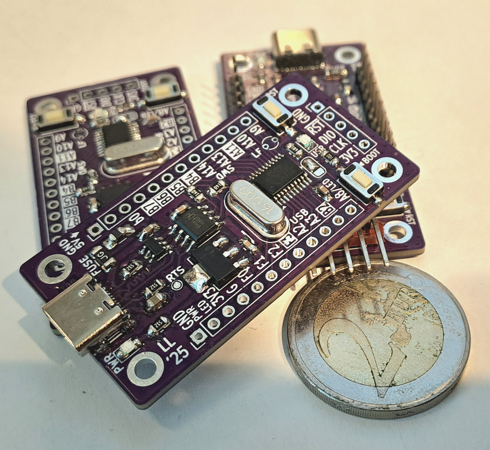

# pu(rple)pill32
## Compact and inexpensive USB-C development board for PY32F030 (TSSOP20) 32-bit MCU

RevA had some glitches, please refer to changelog in the revB schematic or below.
RevB tested to be functional, and can be flash-programmed over USB (see bootloader access below).

## Features

* development/evaluation board for Pyua PY32F030F1xP6 MCU (TSSOP20)
* USB serial (CH340N, ESD protection)
* USB bootloader support (e.g. puyaisp.py from MCU-Flash-Tools /1/)
* 48 MHz operation with internal oscillator
* option for 32.768 kHz crystal (if used, pins PA9 and PA10 reserved)
* all peripheral pins available
* SWD header for programming (by using USB bootloader for flashing, those pins can be configured for other purposes**)
* 3V3 linear regulator; 3V3 logic levels
* powered from USB (SMD fuse for overcurrent protection)
* PWR LED and user-programmable USR led (activated by solder bridge)
* RESET and BOOT buttons

**) In that case, if you don't need pull-ups for your signals, do not populate R11-R12.

## Bootloader access

USB UART is connected to PA2/PA3 (TX/RX). To access bootloader (e.g. puyaisp.py /1/, USB-to-serial), either

* Disconnect USB cable, press and hold BOOT button then connect the cable.

OR 

* Connect USB cable, press and hold BOOT button and press and release RESET button

/1/ [https://github.com/wagiminator/MCU-Flash-Tools]

## Images

## Changelog revA --> revB

* added C19 (bug)
* swapped UART RX/TX (bug)
* added R1 (boot0 pulldown)
* R2 -> 5k1 (brightness)
* C20 tantalum
* SWD resistors R9-R12 added

## Independent project -- no affiliation or endorsement

This project is no way affiliated with Puya Semiconductor or any other commercial body. This is an indie evaluation board designed and built by a hobbyist. You may use this open hardware design, at your own risk, according to its license conditions, see the following chapter. 

## References

/2/ [J. Carlson: The cheapest flash microcontroller you can buy is actually an ARM CORTEX-M0+](https://jaycarlson.net/2023/02/04/the-cheapest-flash-microcontroller-you-can-buy-is-actually-an-arm-cortex-m0/)

/3/ [OpenPuya -- py32.org](https://py32.org/en/)

## License

This board is licensed under CERN Open Hardware License, version 2, CERN-OHL-W (weakly reciprocal). 

Please refer to LICENSE file for more information.
